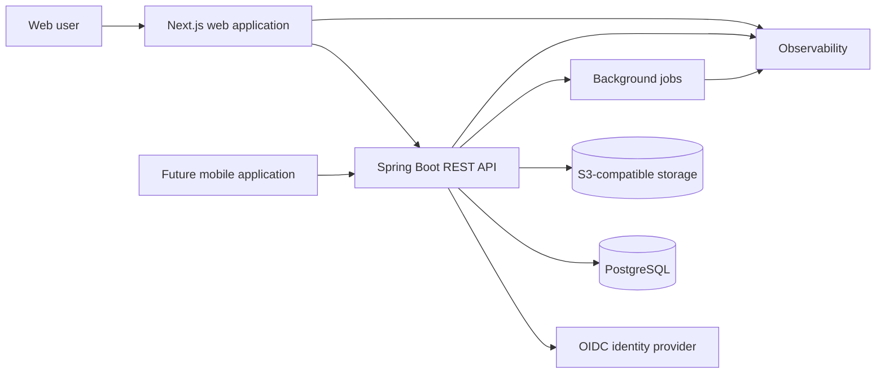

# System Architecture

## Architecture objective

Build a portable modular monolith that can move from local development to managed staging and AWS production without changing the core application stack.

## Chosen application stack

| Concern | Choice |
|---|---|
| Web | Next.js, React, TypeScript |
| Data fetching | TanStack Query |
| Forms | React Hook Form and Zod |
| 3D | Three.js through React Three Fiber |
| Runtime 3D format | Compressed GLB/glTF |
| API | Java 21 and Spring Boot |
| API style | REST described by OpenAPI |
| Database | PostgreSQL |
| Schema migration | Flyway |
| Authentication | Spring Security with OIDC integration |
| Media | S3-compatible object storage |
| Mobile later | Expo and React Native |
| CI/CD | GitHub Actions |
| Observability | OpenTelemetry-compatible telemetry |

## High-level system



## Responsibility boundaries

### Next.js web application

- Renders public and authenticated interfaces.
- Manages view state and active drafts.
- Performs immediate user-feedback validation.
- Runs the interactive 3D scene in client components.
- Calls only documented API contracts.
- Does not contain authoritative business rules.

### Spring Boot API

- Authenticates and authorizes requests.
- Enforces ownership at query level.
- Performs authoritative validation.
- Executes domain rules and transactions.
- Generates signed media operations.
- Publishes post-commit work to background processing.
- Produces OpenAPI contracts and telemetry.

### PostgreSQL

- Source of truth for structured application data.
- Enforces constraints and relationships.
- Supports transactional workout writes.
- Supports progress aggregation through indexed queries.

### Object storage

- Stores approved photos and reports.
- Uses private objects by default.
- Exposes short-lived signed operations.
- Never relies on a container's local filesystem.

## Backend modules

```text
com.projectmt.api/
|-- auth/
|-- profile/
|-- workout/
|-- routine/
|-- checkin/
|-- progress/
|-- journal/
|-- media/
|-- notification/
`-- shared/
```

Each module owns its HTTP DTOs, application service, domain rules, persistence boundary, and tests. Modules may share infrastructure through explicitly defined interfaces.

## Frontend modules

```text
src/
|-- app/
|-- components/
|-- features/
|   |-- auth/
|   |-- onboarding/
|   |-- home/
|   |-- body-model/
|   |-- workouts/
|   |-- routines/
|   |-- progress/
|   |-- journal/
|   `-- profile/
|-- services/
|-- state/
|-- types/
`-- utils/
```

## Data ownership

- The API owns persisted data.
- The browser owns temporary view state.
- Active workout drafts follow the separately approved durability policy.
- Derived body models reference source measurements and an algorithm version.
- Historical workouts are immutable except through an audited correction path.

## Transaction boundaries

A completed workout is saved in one transaction:

1. Validate ownership and input.
2. Insert or update the session.
3. Persist ordered exercises.
4. Persist ordered sets.
5. Commit the complete graph.
6. Publish post-commit analytics/notification work.

No partial workout may remain after a failed transaction.

## Security boundaries

- Browser input is untrusted.
- Authentication does not imply ownership.
- Every user-owned query includes the authenticated user ID.
- Long-lived secrets never enter frontend bundles.
- Sensitive media stays private.
- Logs exclude credentials, raw tokens, journal content, and body measurements.

## Scaling model

Scale vertically first, then horizontally:

1. Optimize queries and indexes.
2. Increase API/database capacity.
3. Run multiple stateless API containers.
4. Add Redis for measured hot data.
5. Add queues/workers for slow post-commit work.
6. Add database replicas for read-heavy workloads.
7. Extract a service only when ownership, isolation, or scaling evidence justifies it.

## Explicitly deferred

- Microservices
- Kubernetes
- Kafka
- GraphQL
- Dedicated search cluster
- Machine-learning recommendation infrastructure

Each requires an ADR and evidence before adoption.

