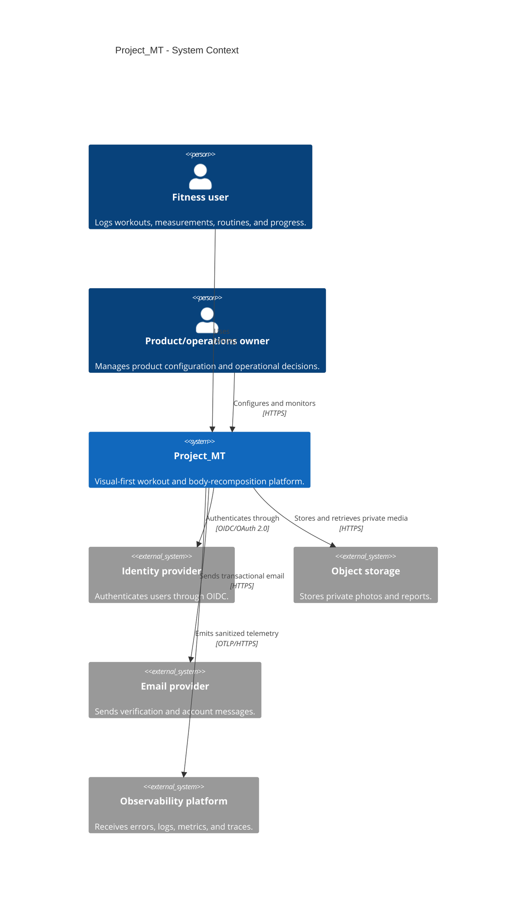

# C4 Level 1: System Context

## Purpose

Show Project_MT and its external actors/systems without implementation detail.

## Notes

- Community users are not separate actors until public social features are approved.
- The 3D model is an application capability, not an external clinical system.
- No medical or diagnostic system integration is implied.

