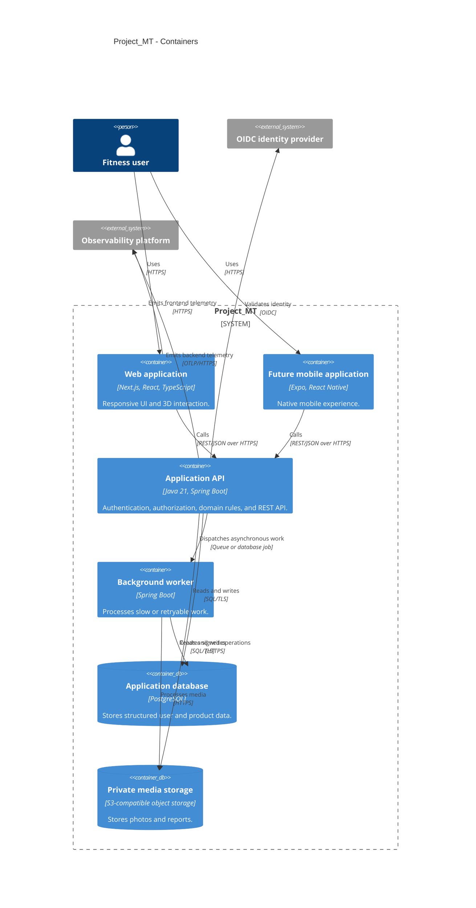

# C4 Level 2: Container Diagram

## Container rules

- The web application never connects directly to PostgreSQL.
- The API and worker are stateless.
- Media bytes do not pass through the API when a signed direct upload is suitable.
- The worker may initially run inside the API deployment but must retain a clean boundary.

