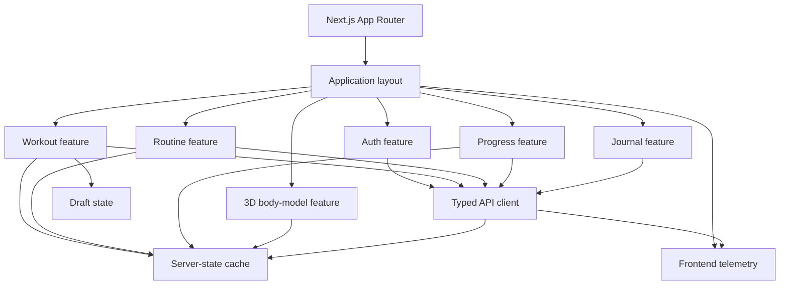

# C4 Level 3: Web Components

## Component rules

- Feature modules do not call `fetch` directly; they use the typed API client.
- Server state is not duplicated into a general global store.
- Draft state is separate from persisted workout history.
- Three.js code loads only on routes/components that need it.
- Accessible muscle controls exist independently of the canvas.
- API-generated types are not edited manually.

