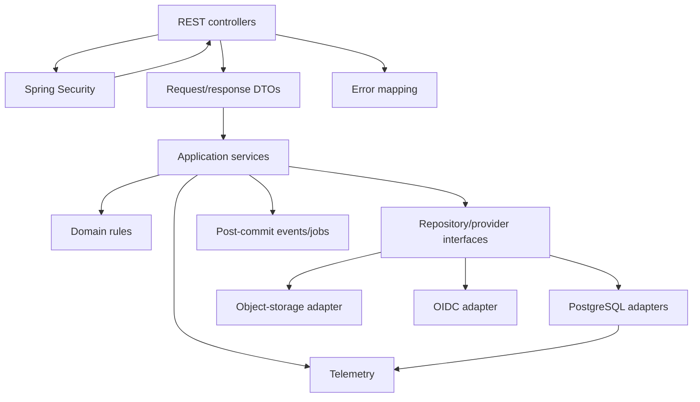

# C4 Level 3: API Components

## Request path

1. Security establishes the authenticated principal.
2. Controller maps the HTTP request into a validated DTO.
3. Application service coordinates the use case and transaction.
4. Domain rules enforce business invariants.
5. Repository/provider interfaces isolate infrastructure.
6. Exceptions become stable API error contracts.
7. Telemetry records safe operational context.

## Dependency direction

Domain logic must not depend on Spring MVC, PostgreSQL drivers, object-storage SDKs, or identity-provider SDKs.

