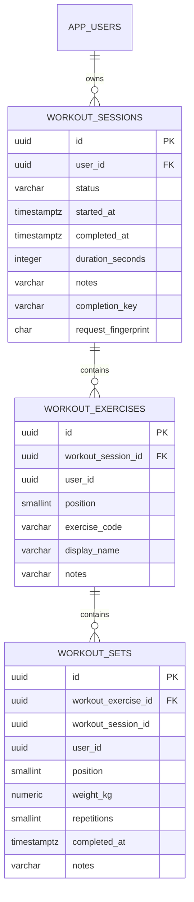

# Workout Persistence Schema

## Purpose

The workout schema stores a user's training history as an ordered,
ownership-enforced hierarchy:

## Invariants

- A workout belongs to exactly one internal application user.
- Exercise ownership must match the owning workout session.
- Set ownership and session identity must match the parent exercise.
- Exercise positions are unique within a session.
- Set positions are unique within an exercise.
- Completed sessions have a completion time and duration.
- In-progress and discarded sessions cannot contain completion metadata.
- A completed set has both weight and repetitions.
- A completed session has a user-scoped completion key and payload
  fingerprint.
- A completion key cannot identify two different workouts for the same user.
- Deleting a session deletes its exercise and set children.

## Historical stability

`exercise_code` is the stable identifier used for exercise-history queries.
`display_name` is copied into the workout exercise as a historical snapshot.
Future changes to an exercise catalog or routine must not rewrite completed
workout history.

## Query paths

- `(user_id, started_at DESC)` supports a user's chronological session list.
- `(user_id, completed_at DESC)` supports completed workout history.
- `(user_id, exercise_code, workout_session_id)` locates previous performance
  for a specific exercise while preserving ownership filtering.

## Units and limits

- Weight is stored canonically in kilograms with three decimal places.
- Session duration is stored in seconds.
- A session duration is limited to seven days as a corruption guard.
- Repetitions are limited to 1–1000.
- Weight is limited to 0–2000 kg, allowing body-weight or unloaded movements
  to use zero.
- Notes are bounded at each hierarchy level to prevent accidental oversized
  records.

Display-unit conversion belongs at the API or client boundary. The database
does not store locale-formatted values.

## Migration

The schema is introduced by
`V4__create_workout_schema.sql`. Completion idempotency is introduced by
`V5__add_workout_completion_idempotency.sql`. Applied migrations remain
immutable; later changes require a forward-fix migration.
