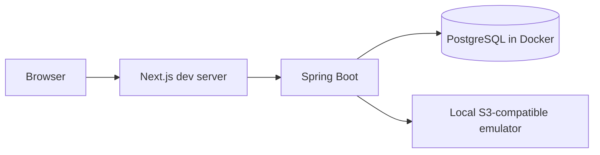

# Deployment Stage 1: Local Development

## Components

## Requirements

- PostgreSQL runs in Docker Compose.
- Spring Boot runs locally or in Docker.
- Next.js runs locally for fast refresh.
- Secrets use ignored local environment files.
- Flyway migrates an empty database.
- Testcontainers provides isolated integration-test databases.

## Exit criteria

- One documented command starts dependencies.
- A new developer can run the system from a clean checkout.
- Local behavior matches production data types and constraints.

