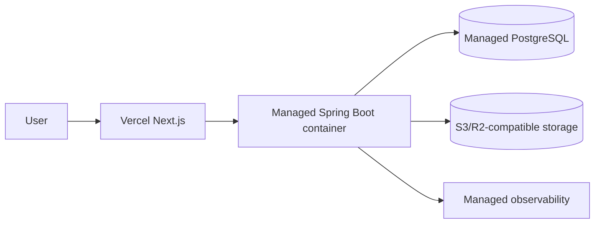

# Deployment Stage 2: Early Staging

## Suggested topology

## Purpose

- Validate complete deployments.
- Test migrations with production-like services.
- Produce preview environments where affordable.
- Run end-to-end and smoke tests.
- Support owner acceptance testing.

## Rules

- Staging has isolated data and credentials.
- Production personal data is never copied casually.
- The same application artifact is promoted toward production.
- Provider-specific features do not contain core business logic.

## Exit criteria

- GitHub Actions deploys reproducibly.
- Database migrations run safely.
- Health checks and telemetry operate.
- Rollback procedure is documented.

## Pipeline

The executable staging pipeline is documented in [Staging deployment pipeline](STAGING_PIPELINE.md).
