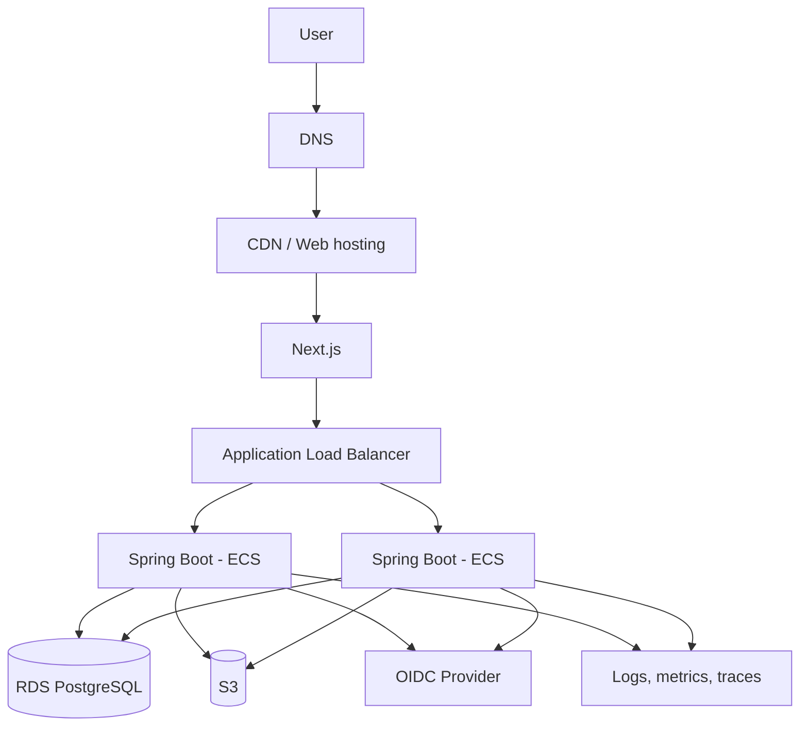

# Deployment Stage 3: Production

## Target topology

## Production controls

- HTTPS only.
- API containers are stateless.
- Database is private and encrypted.
- Secrets come from a managed secret store.
- Backups and point-in-time recovery are enabled.
- At least two API tasks run across failure domains when availability requires it.
- Deployment uses health checks and gradual replacement.
- Security, privacy, and accessibility checks gate release.

## Migration from staging

The application stack does not change. Migration consists of:

- Publishing the same container images to the production registry.
- Creating production networking and managed services.
- Applying environment-specific configuration.
- Migrating/initializing PostgreSQL with Flyway.
- Moving media through provider-supported object-copy tools where necessary.

