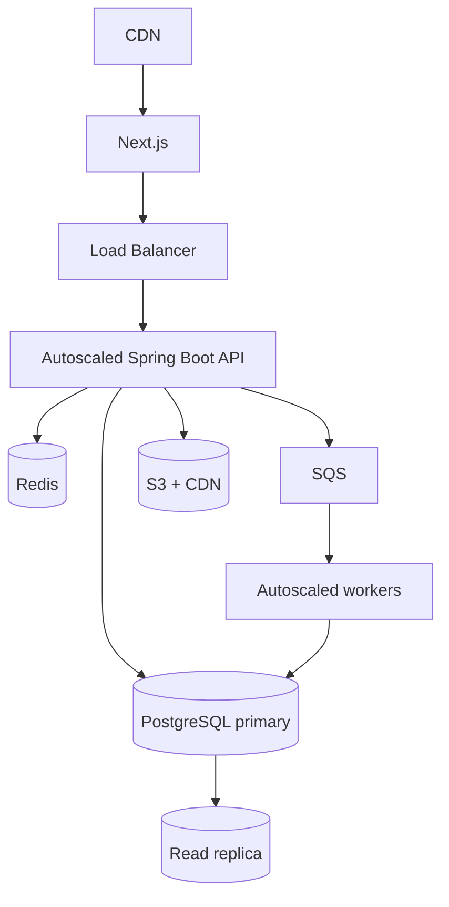

# Deployment Stage 4: Scaling

## Add only after measurement

## Scaling order

1. Measure latency, throughput, error rates, and query plans.
2. Fix inefficient code and indexes.
3. Increase container and database capacity.
4. Add API horizontal scaling.
5. Cache only measured hot and safe-to-cache data.
6. Move slow/retryable work to a queue.
7. Add read replicas for proven read pressure.
8. Partition or archive only when table growth requires it.
9. Extract services only for independent ownership, scaling, or failure isolation.

## Signals for new infrastructure

| Addition | Evidence required |
|---|---|
| Redis | Repeated expensive reads with acceptable staleness |
| Queue/workers | Requests blocked by slow, retryable work |
| Read replica | Primary read load remains high after query optimization |
| Search engine | PostgreSQL search cannot meet measured requirements |
| Service extraction | Independent scaling/ownership outweighs distributed complexity |

