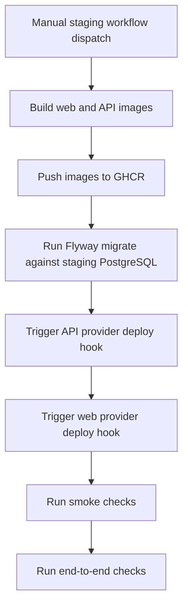

# Staging Deployment Pipeline

Project_MT staging deployments are driven by GitHub Actions and the `staging` GitHub Environment. Staging is intentionally isolated from production and local development.

## Approved providers

| Responsibility                              | Approved staging provider                              | Configuration boundary                                                |
| ------------------------------------------- | ------------------------------------------------------ | --------------------------------------------------------------------- |
| Source control and deployment orchestration | GitHub Actions                                         | `.github/workflows/staging.yml`                                       |
| Image registry                              | GitHub Container Registry                              | `ghcr.io/<owner>/project-mt-api` and `ghcr.io/<owner>/project-mt-web` |
| Web hosting                                 | Provider exposed through `STAGING_WEB_DEPLOY_HOOK_URL` | Provider-specific deployment stays behind a deploy hook               |
| API hosting                                 | Provider exposed through `STAGING_API_DEPLOY_HOOK_URL` | Provider-specific deployment stays behind a deploy hook               |
| Database                                    | Managed PostgreSQL                                     | `STAGING_DATABASE_*` secrets                                          |
| Object storage                              | S3/R2-compatible storage                               | staging-only bucket and credentials                                   |

Ask for project-owner guidance before changing approved providers, registry names, deployment hooks, or secret names.

## Required GitHub Environment configuration

Create a GitHub Environment named `staging` and configure required reviewers before allowing deployment.

### Environment variables

- `STAGING_WEB_URL`
- `STAGING_API_BASE_URL`

### Environment secrets

- `STAGING_WEB_DEPLOY_HOOK_URL`
- `STAGING_API_DEPLOY_HOOK_URL`
- `STAGING_DEPLOY_HOOK_TOKEN`
- `STAGING_DATABASE_URL`
- `STAGING_DATABASE_USERNAME`
- `STAGING_DATABASE_PASSWORD`
- staging Auth0/OIDC secrets
- staging S3/R2 bucket credentials

Production credentials must not be reused in staging.

## Deployment flow

Flyway runs with:

- `cleanDisabled=true`
- `validateMigrationNaming=true`
- read-only migration files mounted from the repository
- staging-only database credentials

## Smoke and end-to-end checks

The workflow runs:

- `scripts/staging/smoke-test.mjs`
  - verifies API readiness at `/actuator/health/readiness`
  - verifies web health at `/api/health`
- `scripts/staging/e2e-check.mjs`
  - verifies the deployed web entry point returns expected Project_MT content

These checks are intentionally small until authenticated browser tests are added.

## Rollback procedure

1. Open the `Staging Deployment` workflow.
2. Choose `rollback`.
3. Enter the previous known-good image tag.
4. Run the workflow against the `staging` environment.
5. Confirm smoke and end-to-end checks pass.
6. Record the rollback in the related issue or release notes.

Rollback uses the same provider deploy hooks as forward deployment, but points them at the existing image tag instead of building new images.

## Rollback exercise requirement

Before promoting a release candidate to production, exercise rollback at least once in staging by redeploying the previous staging image tag and confirming the post-deploy checks pass.
