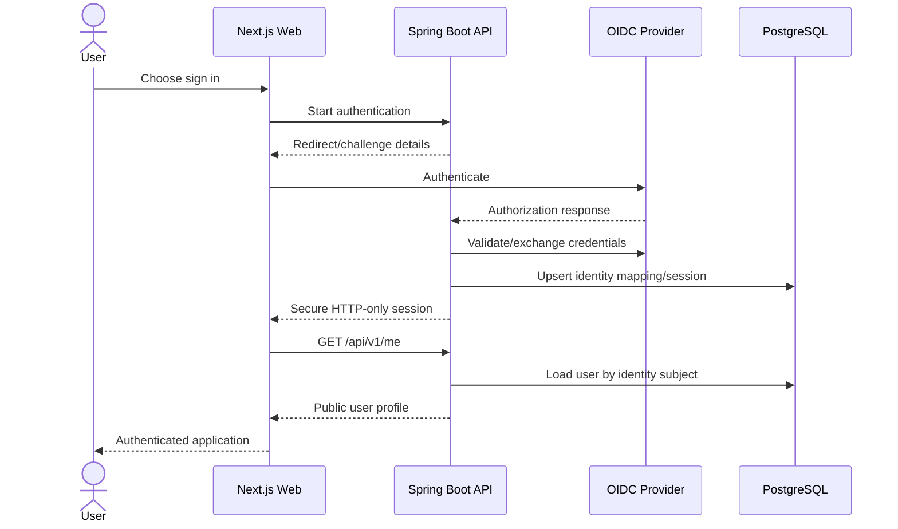

# Sequence: Authentication

## Failure behavior

- Invalid or expired authentication returns a generic unauthorized response.
- Authentication errors never reveal secrets.
- Logout revokes the application session.
- Authorization and ownership checks still occur after successful authentication.

## Open decision

The exact OIDC provider requires owner guidance on budget, deployment region, and account-recovery requirements.

