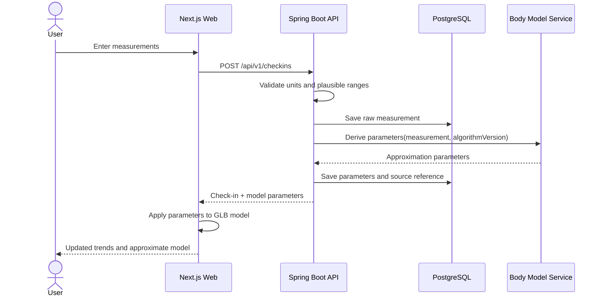

# Sequence: Check-in and Body Model

## Rules

- Raw measurements are retained independently from derived values.
- Missing optional values are handled explicitly.
- The algorithm version is stored.
- Recalculation creates traceable derived output.
- The UI labels the model as an approximation, not a clinical scan.

