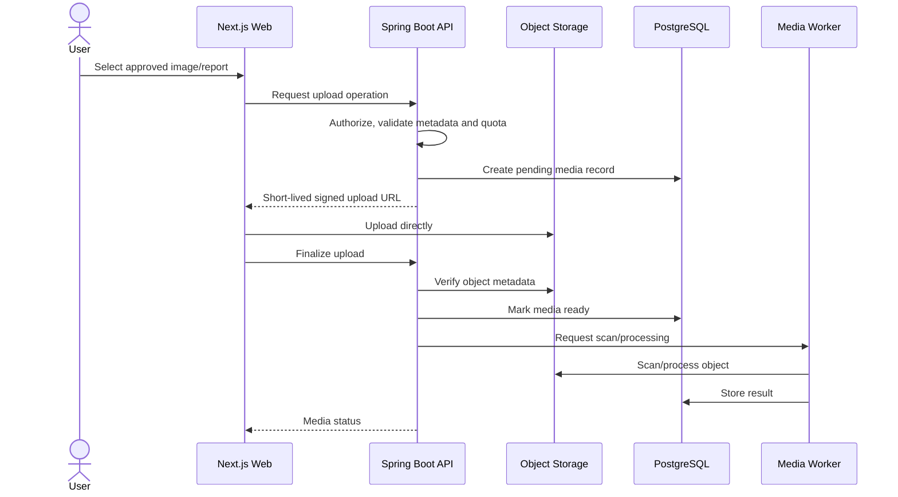

# Sequence: Private Media Upload

## Rules

- Objects are private by default.
- File extension alone is not trusted.
- Size, content type, and content are validated.
- Pending/failed objects are cleaned up.
- Deleting user media deletes the stored object and metadata according to retention policy.

