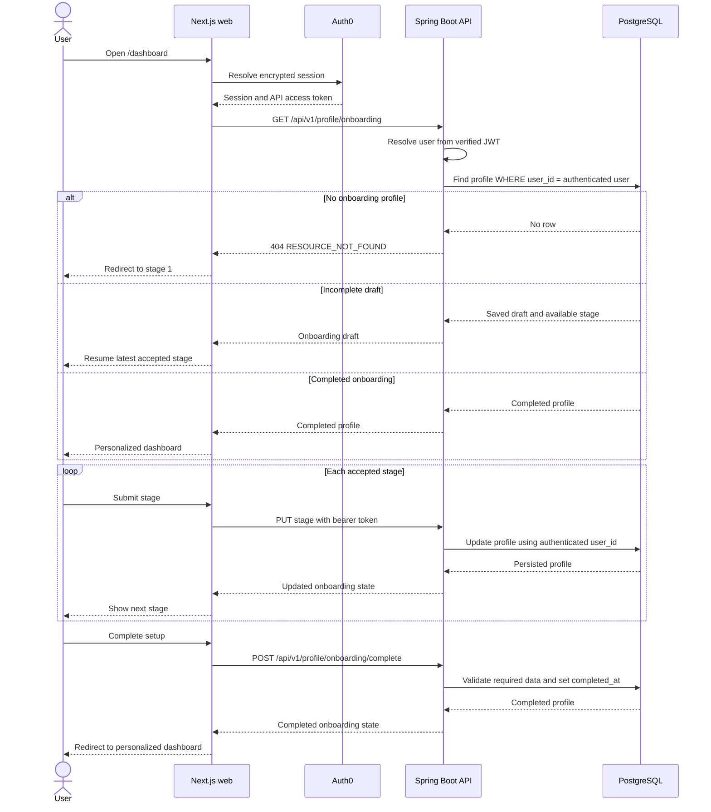

# Persistent Onboarding Sequence

## Purpose

Onboarding captures enough information to personalize the first authenticated
home state without forcing a user to provide optional body measurements.

## Data classification

| Field | Requirement | Purpose |
|---|---|---|
| Display name | Required | Personalizes the private application interface |
| Primary goal | Required | Selects the initial training emphasis |
| Target areas | Required, one or more | Prioritizes relevant muscle groups |
| Experience level | Optional | Adjusts future guidance complexity |
| Height and weight | Optional, sensitive | Adds context to progress and future guidance |

Body measurements are private profile data. The interface explains their
purpose before collection, and the API never accepts a caller-supplied user ID.

## Save and resume flow

## Persistence rules

- Stage 1 creates the profile if it does not exist.
- Later stages require the authenticated user's profile.
- `onboarding_step` only moves forward, so revisiting an earlier stage cannot
  erase accepted progress.
- Each stage updates only its own fields.
- Completion requires a primary goal and at least one target area.
- Every query derives ownership from the verified JWT identity.

## Guidance checkpoints

Ask the product owner for guidance before changing goal choices, target-area
taxonomy, required fields, measurement ranges, privacy wording, or completion
behavior. Those choices affect stored data, recommendations, and user trust.
