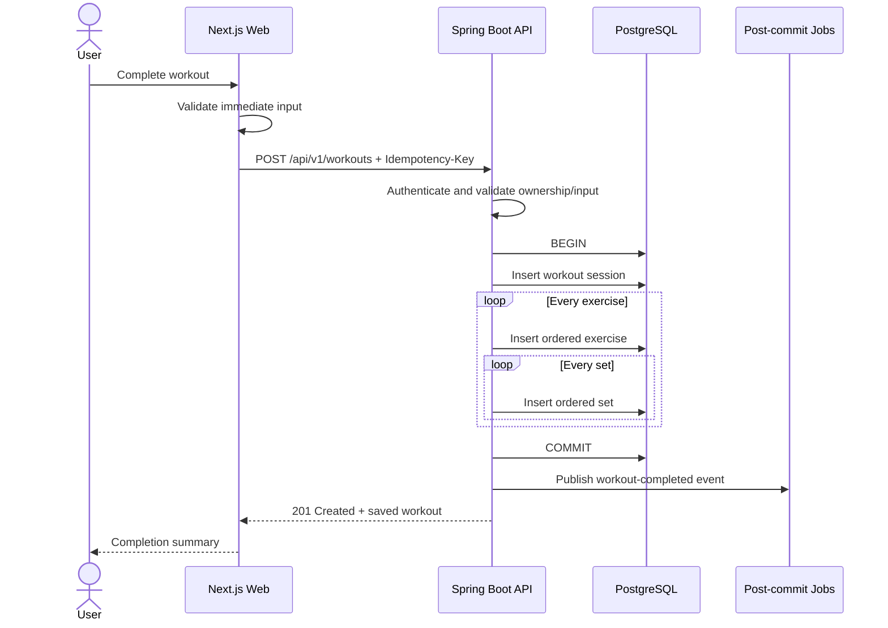
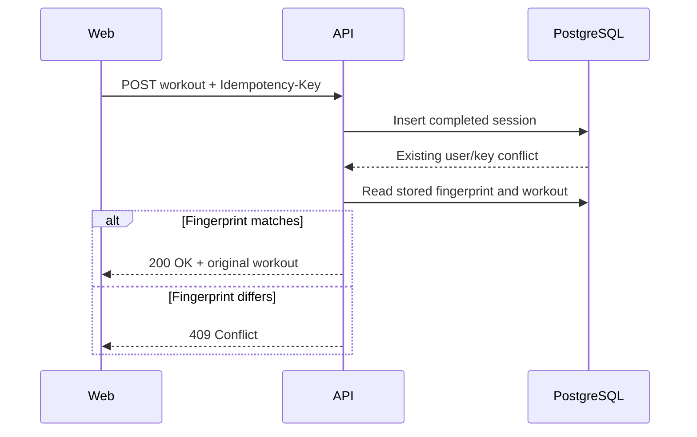
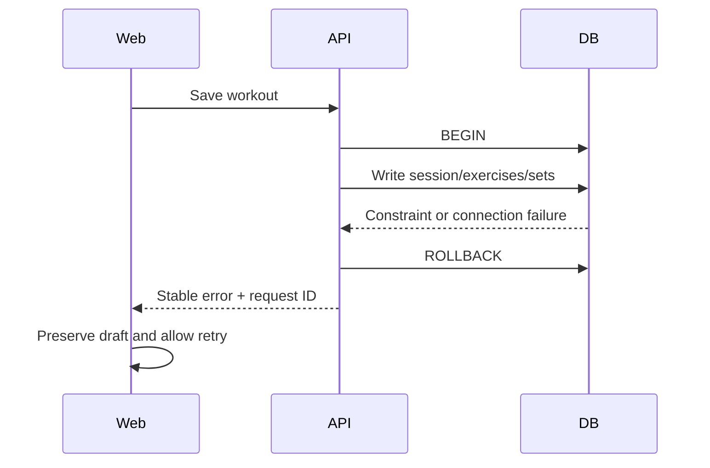

# Sequence: Workout Lifecycle

## Save completed workout

## Idempotent retry

The key is scoped to the authenticated internal user. A retry with the same
normalized payload returns the original representation. Reusing the key for a
different payload is rejected.

## Failure behavior

## Invariants

- No partial completed workout is persisted.
- Idempotency prevents duplicate completion if a retry repeats the same request.
- Completed volume excludes incomplete sets.
- Historical ordering is preserved.

