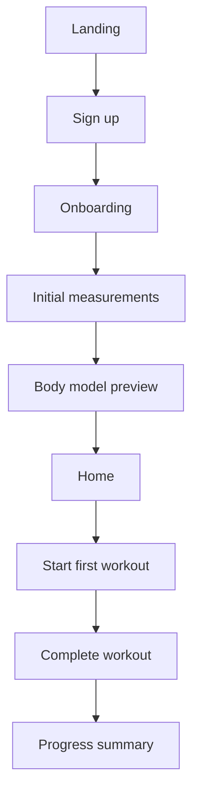
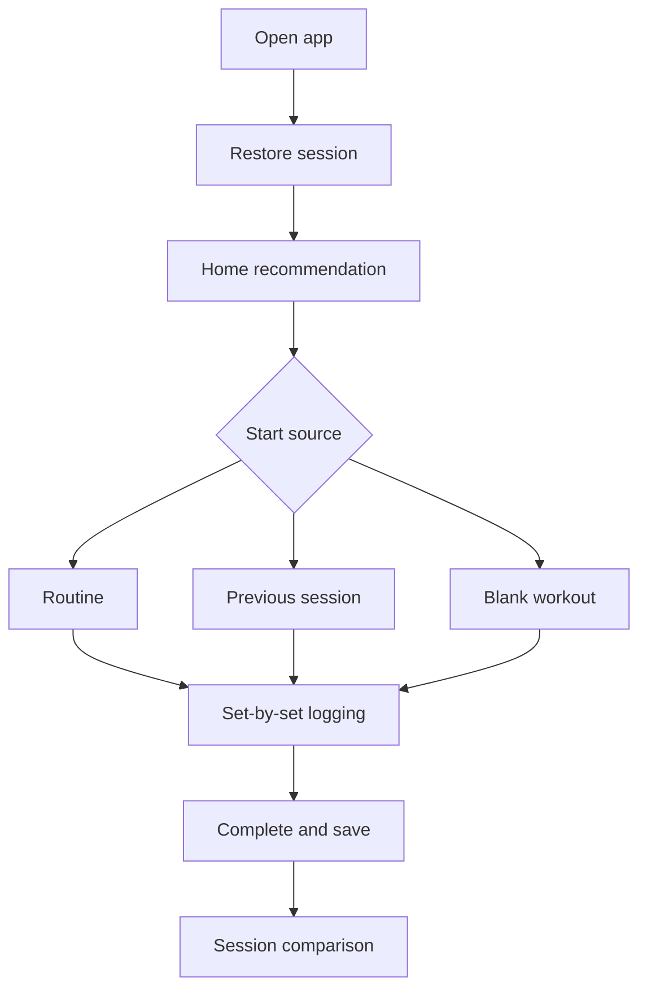
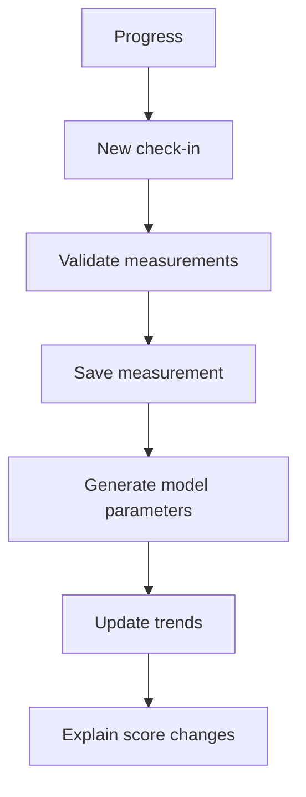
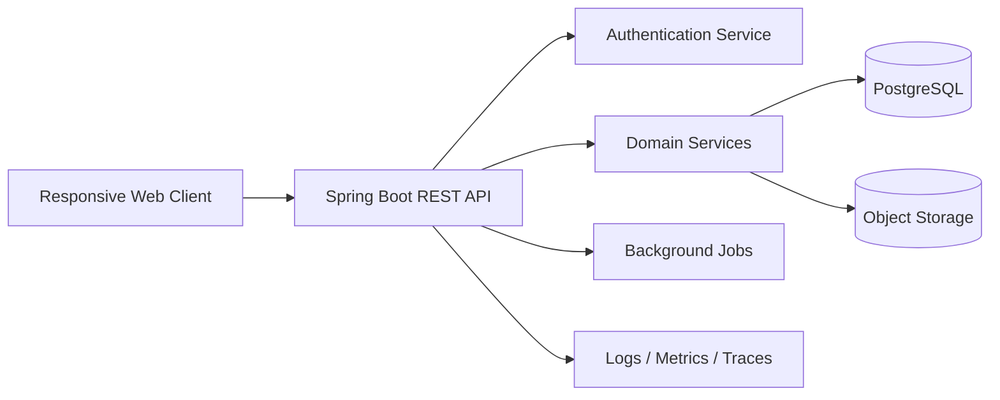
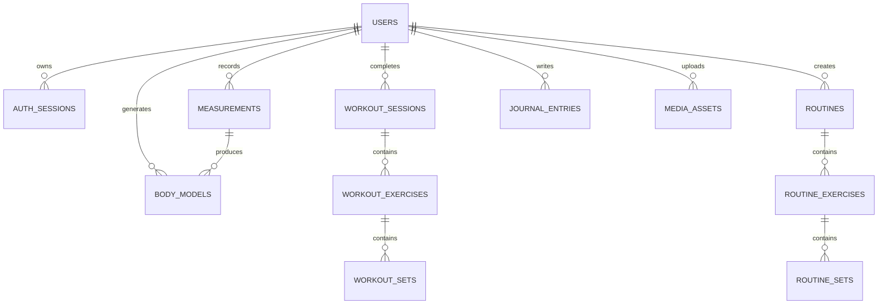

# Project Muscle Web Application: Product, Architecture, and Delivery Guide

**Document status:** Working implementation brief  
**Last reviewed:** 2026-07-02  
**Primary target:** Responsive web application  
**Current primary backend:** Java 17 with Spring Boot  
**Current frontend:** Static HTML, CSS, and JavaScript with Three.js

---

## 1. Purpose of This Document

This document is the implementation source of truth for turning Project Muscle into a complete, reliable web application. It combines:

- Product definition and boundaries
- User flows and screen requirements
- Current repository and implementation status
- Recommended frontend and backend architecture
- API and data contracts
- Security, privacy, validation, and accessibility requirements
- Testing, deployment, and observability requirements
- A phased delivery plan with acceptance criteria
- Decisions that require product-owner guidance

This is not only a feature list. It should be used by designers, frontend engineers, backend engineers, QA engineers, and AI coding agents to determine what to build and how to verify it.

### Required collaboration rule

When a requirement is unclear, conflicts with another requirement, changes product scope, affects user privacy, or has multiple materially different design choices, **ask the project owner for guidance before implementing the decision**.

Do not silently invent product rules. Make reasonable implementation-level assumptions only when they are reversible, low risk, and consistent with this document. Record important assumptions.

---

## 2. Product Definition

Project Muscle is a visual-first body recomposition and strength-training application. Its primary experience is an interactive body model that helps users:

1. Understand what muscle group to train next
2. Start and complete a workout with minimal friction
3. Track set-by-set performance
4. Record body measurements and supporting lifestyle data
5. See understandable progress over time
6. Receive explainable, non-medical recommendations

### Product positioning

The intended product direction is:

> High-quality strength logging + body-model-first motivation + transparent progression guidance.

### Core value proposition

The app should answer three questions:

- What should I train?
- What did I do last time?
- Am I progressing toward my goal?

### Product principles

- **Logging must be trustworthy.** Workout history cannot disappear or silently lose fields.
- **The body model is an interaction surface.** It should help users choose targets and understand progress; it must not pretend to be a clinical scan.
- **Recommendations must be explainable.** Show why a recommendation was made.
- **Private by default.** Personal measurements, journal entries, photos, and body-composition data require explicit sharing choices.
- **Fast common path.** A returning user should be able to begin logging within a few interactions.
- **Honest health language.** Do not promise spot fat loss, medical diagnosis, or clinical accuracy.

### V1 non-goals

- Medical diagnosis or treatment
- Clinical-grade body composition analysis
- Automatic 3D reconstruction from video
- Fully autonomous AI coaching
- A complete meal-planning platform
- Public rankings or an unmoderated social network
- Wearable integrations unless specifically approved for a later phase

---

## 3. Target Users and User Jobs

### Primary user: visual progress seeker

Wants visible body changes and responds strongly to a visual representation of progress.

Key jobs:

- Set a body-composition goal
- Select target body areas
- Log measurements consistently
- Understand trends without interpreting raw data alone

### Primary user: strength-training logger

Needs reliable workout history and quick access to previous loads and repetitions.

Key jobs:

- Create reusable routines
- Copy a previous workout
- Log each set independently
- Compare current and previous sessions
- Identify progression or regression

### Secondary user: consistency builder

Needs simple next actions and accountability rather than advanced programming.

Key jobs:

- Receive one clear recommended focus
- Complete a short workout
- Track adherence
- Understand which behavior improves the progress score

---

## 4. Success Measures

The application should instrument these events so product success can eventually be measured:

- Account created
- Onboarding completed
- First check-in saved
- First workout started
- First workout completed
- Routine created
- Previous session copied
- Seven-day return
- Four-week check-in consistency
- Workout completion rate
- Average time required to log one set
- Recommendation viewed and followed

Initial product targets require owner approval. Before analytics targets or retention thresholds are treated as commitments, **ask the project owner for guidance**.

---

## 5. Current Repository Structure

```text
ProjectMuscle/
├─ apps/
│  ├─ web/                 Current static web client
│  │  ├─ index.html
│  │  ├─ styles.css
│  │  ├─ app.js
│  │  ├─ assets/
│  │  │  └─ male_body.fbx
│  │  └─ vendor/
│  ├─ server-java/         Primary Spring Boot API
│  │  ├─ pom.xml
│  │  ├─ projectmuscle.db
│  │  └─ src/main/
│  │     ├─ java/com/projectmuscle/server/
│  │     └─ resources/
│  └─ server/              Legacy Node/TypeScript API
├─ packages/
│  ├─ api/                 TypeScript API utilities
│  ├─ core/                Shared TypeScript domain code
│  └─ ui/                  Shared TypeScript UI constants
├─ docs/                   Existing product and architecture notes
├─ scripts/
│  └─ supabase_schema.sql
├─ package.json
└─ README.md
```

### Current implementation facts

- The web client is a single-page static application served on port `5173`.
- The frontend uses Three.js and loads `male_body.fbx`.
- Most frontend logic currently lives in one large `app.js` file.
- The primary API is Spring Boot on port `4000`.
- Workouts and routines are persisted in SQLite.
- Users, sessions, check-ins, body models, journals, nutrition, recovery, activities, and body-composition reports currently use in-memory storage.
- There is also a legacy Node API. It should not remain an active competing backend unless the project owner explicitly wants both.
- There are currently no Java backend tests in `src/test`.

### Current run commands

Backend:

```bash
cd apps/server-java
mvn spring-boot:run
```

Frontend:

```bash
cd apps/web
npm install
npm run dev
```

Open:

```text
http://localhost:5173
```

Default API:

```text
http://localhost:4000/api
```

---

## 6. Current Application Capabilities

### Authentication and profile

- Sign up with email and password
- Sign in
- Bearer-token authentication
- Retrieve current user
- Save onboarding fields:
  - Display name
  - Goal
  - Target areas
  - Height
  - Sex
  - Birth year

### Home

- Goal-proximity display
- Today-focus recommendation
- Interactive 3D model
- Front/back model state
- Skin/muscle viewing modes
- Muscle hitboxes and selection
- Quick workout entry from selected muscle

### Workouts

- Select muscle group
- Add exercises
- Add set rows
- Copy the previous session
- Save workouts
- Load workout history
- Compare recent workout volume

### Routines

Backend support exists for:

- Create routine
- List routines
- Retrieve routine
- Convert routine into an unsaved or saved workout

The web UI needs explicit routine-management screens and interactions.

### Progress and supporting logs

- Save and retrieve body check-ins
- Generate basic body-model parameters
- Save and retrieve journal posts
- Load a community feed
- API support for nutrition, recovery, activities, and body-composition reports

Several supporting API domains do not yet have complete first-class frontend screens.

---

## 7. Required V1 Navigation and Screens

Recommended primary mobile navigation:

1. Home
2. Workouts
3. Progress
4. Journal
5. Profile

Desktop may use a sidebar or persistent top navigation, but information architecture should remain consistent.

### 7.1 Authentication

Required states:

- Sign up
- Sign in
- Sign out
- Expired or invalid session
- Loading
- API unavailable

Required behavior:

- Validate email format
- Enforce password policy
- Do not reveal whether an account exists in sensitive recovery/authentication flows
- Display actionable error messages
- Restore a valid session on reload
- Redirect authenticated users away from sign-in where appropriate

Password reset and email verification require an email provider and product decision. **Ask the project owner for guidance before selecting or implementing a provider.**

### 7.2 Onboarding

Recommended steps:

1. Welcome and product boundaries
2. Display name and basic profile
3. Primary goal
4. Target body areas
5. Height and optional demographic fields
6. Initial body measurements
7. Optional privacy consent for photos or community features
8. Completion summary

Required goal values:

- `fat_loss`
- `muscle_gain`
- `recomposition`

Required behavior:

- Allow safe back navigation without losing completed fields
- Clearly label optional fields
- Explain why sensitive information is requested
- Allow users to skip optional photos and reports

### 7.3 Home

Required elements:

- Interactive body model
- Selected muscle and muscle-group label
- Today-focus recommendation
- Explanation for the recommendation
- Quick-start workout action
- Current goal-proximity score
- Score breakdown
- Recent activity summary
- Empty state for new users

The goal-proximity score must never appear scientifically precise unless the calculation supports that claim. It should be presented as a behavioral/progress indicator.

### 7.4 Workouts

Required workout session flow:

1. Select or confirm muscle group
2. Start from blank, routine, or previous workout
3. Add one or more exercises
4. Add/edit set rows
5. Mark sets complete
6. Optionally add notes
7. Review summary
8. Save completed session

Each set should support:

- Set number
- Previous weight
- Previous reps
- Current weight
- Current reps
- Completion status
- Optional note
- Future: RPE/RIR, warm-up flag, rest duration

Required workout actions:

- Add/remove/reorder exercise
- Add/remove set
- Copy prior set values
- Copy previous session
- Save draft or protect against accidental navigation
- Complete workout
- View history by muscle or exercise
- Compare two sessions

Whether drafts are persisted server-side or locally is a product/data-reliability decision. **Ask for guidance before choosing the final draft behavior.**

### 7.5 Routines

Required screens:

- Routine list
- Create routine
- Edit routine
- Routine detail
- Start workout from routine
- Delete/archive confirmation

Each routine contains:

- Name
- Muscle group
- Ordered exercises
- Ordered set templates
- Target load
- Target repetitions
- Optional notes

The current backend supports create/read/start but not update/delete. Those API operations are required for a complete routine UI.

### 7.6 Progress

Required views:

- Measurement history
- Weight trend
- Waist and body-fat trend where available
- Workout consistency
- Training volume trend
- Personal records
- Body-model snapshot or parameter history
- Goal-proximity explanation

Charts must:

- Include units
- Support accessible text summaries
- Handle sparse data
- Avoid implying causation
- Use consistent date ranges

### 7.7 Check-ins

Fields:

- Date
- Weight in kilograms
- Body-fat percentage, optional
- Chest circumference
- Waist circumference
- Hip circumference
- Arm circumference
- Thigh circumference
- Optional notes in the target design

Required validation:

- Valid ISO date
- Positive and plausible measurement ranges
- Explicit units
- Partial check-in policy defined

The current body-model computation assumes circumference values exist. The target implementation must either require all relevant fields or safely support partial data.

### 7.8 Journal

Required behavior:

- Private by default
- Title, mood, content, date
- Optional image
- Clear private/public control
- Personal feed
- Optional community feed
- Edit/delete own entry

Before public posting is released, define:

- Reporting
- Blocking
- Moderation
- Content removal
- Age restrictions
- Image storage and retention

**Ask the project owner for guidance before enabling a real public community feed.**

### 7.9 Profile and settings

Required sections:

- Account
- Goal and target areas
- Units
- Privacy
- Export data
- Delete account
- Sign out
- Legal documents
- App version/support

---

## 8. Core User Journeys

### New user



### Returning workout user



### Progress check-in



---

## 9. Recommended Target Architecture



### Recommended production choices

- Frontend: TypeScript with a component-based framework
- Backend: Existing Spring Boot service
- Production database: PostgreSQL
- Local development database: PostgreSQL through Docker, or SQLite only as an explicitly supported development mode
- Object storage: S3-compatible storage for photos/reports
- Authentication: secure server-managed sessions or short-lived access tokens plus rotating refresh tokens
- API specification: OpenAPI
- Database migration: Flyway or Liquibase
- Deployment: separate web and API services

The frontend framework, cloud provider, database host, object-storage provider, and authentication strategy affect cost and architecture. **Ask the project owner for guidance before locking these choices.**

---

## 10. Recommended Frontend Structure

The current `app.js` is too large for safe feature growth. A target structure could be:

```text
apps/web/src/
├─ app/
│  ├─ router/
│  ├─ providers/
│  └─ layout/
├─ components/
│  ├─ buttons/
│  ├─ forms/
│  ├─ feedback/
│  └─ charts/
├─ features/
│  ├─ auth/
│  ├─ onboarding/
│  ├─ home/
│  ├─ body-model/
│  ├─ workouts/
│  ├─ routines/
│  ├─ progress/
│  ├─ journal/
│  └─ profile/
├─ services/
│  ├─ api-client.ts
│  ├─ auth-storage.ts
│  └─ analytics.ts
├─ state/
├─ types/
├─ utils/
├─ styles/
└─ main.ts
```

### Frontend responsibilities

- Render accessible UI
- Manage navigation and transient session state
- Validate for immediate user feedback
- Call the API through one typed client
- Handle loading, empty, success, and failure states
- Protect unsaved workout data
- Never treat client validation as a security boundary

### API client requirements

- Configurable base URL
- Consistent JSON parsing
- Typed request/response contracts
- Authentication injection
- Timeout and cancellation
- Standard error conversion
- One controlled retry policy for safe/idempotent requests
- Request correlation ID support
- Automatic handling of expired sessions

### State boundaries

- Server state: users, workouts, routines, measurements, journals
- Session state: active user and authentication status
- Draft state: currently edited workout or journal
- UI state: selected tab, dialogs, model rotation, filters

Avoid one global mutable state object for all concerns.

---

## 11. Recommended Backend Structure

```text
com.projectmuscle.server/
├─ config/
├─ security/
├─ controller/
│  ├─ AuthController
│  ├─ ProfileController
│  ├─ WorkoutController
│  ├─ RoutineController
│  ├─ CheckinController
│  ├─ ProgressController
│  └─ JournalController
├─ dto/
│  ├─ request/
│  └─ response/
├─ model/
├─ repository/
├─ service/
├─ validation/
├─ exception/
└─ migration/
```

### Backend responsibilities

- Authenticate and authorize every protected operation
- Validate all input
- Enforce ownership at query level
- Execute domain rules
- Persist complete records transactionally
- Return stable API contracts
- Emit structured logs and metrics
- Avoid exposing password hashes or internal errors

### Required backend improvements

- Persist users and sessions
- Persist all tracking domains
- Add database migrations
- Add update/delete/archive operations where needed
- Add pagination
- Add consistent error responses
- Add OpenAPI documentation
- Add automated tests
- Add production security configuration
- Remove duplicated authentication parsing from controllers
- Decide whether to remove the legacy Node backend

---

## 12. Target Data Model

All persisted entities should include appropriate creation/update timestamps. User-owned records must include `user_id`.

### `users`

- `id`: UUID, primary key
- `email`: normalized, unique
- `password_hash`: never returned
- `display_name`
- `sex`: optional
- `birth_year`: optional
- `height_cm`
- `goal`
- `preferred_units`
- `created_at`
- `updated_at`
- `deleted_at`: optional soft deletion

### `auth_sessions`

- `id`
- `user_id`
- `token_hash` or refresh-token identifier
- `created_at`
- `expires_at`
- `revoked_at`
- Optional device/session metadata

### `measurements`

- `id`
- `user_id`
- `measurement_date`
- `weight_kg`
- `body_fat_pct`
- `chest_cm`
- `waist_cm`
- `hips_cm`
- `arm_cm`
- `thigh_cm`
- `notes`
- `created_at`
- `updated_at`

### `body_models`

- `id`
- `user_id`
- `measurement_id`
- `model_date`
- `torso_width`
- `waist_depth`
- `chest_volume`
- `hip_width`
- `arm_size`
- `thigh_size`
- `source`
- `algorithm_version`
- `created_at`

### `workout_sessions`

- `id`
- `user_id`
- `routine_id`: optional
- `workout_date`
- `muscle_group`
- `duration_min`
- `status`: draft/completed
- `notes`
- `started_at`
- `completed_at`
- `created_at`
- `updated_at`

### `workout_exercises`

- `id`
- `session_id`
- `exercise_catalog_id`: optional
- `exercise_name`
- `order_index`
- `notes`

### `workout_sets`

- `id`
- `exercise_id`
- `set_no`
- `weight_kg`
- `reps`
- `completed`
- `previous_weight_kg`
- `previous_reps`
- `rpe`: optional
- `rir`: optional
- `set_type`: working/warmup/drop
- `note`

### `routines`

- `id`
- `user_id`
- `name`
- `muscle_group`
- `description`
- `archived_at`: optional
- `created_at`
- `updated_at`

### `routine_exercises`

- `id`
- `routine_id`
- `exercise_catalog_id`: optional
- `exercise_name`
- `order_index`
- `notes`

### `routine_sets`

- `id`
- `routine_exercise_id`
- `set_no`
- `target_load_kg`
- `target_reps`
- `target_rpe`: optional
- `note`

### `journal_entries`

- `id`
- `user_id`
- `entry_date`
- `title`
- `mood`
- `content`
- `visibility`: private/public
- `image_asset_id`: optional
- `created_at`
- `updated_at`

### `nutrition_entries`

- `id`
- `user_id`
- `entry_date`
- `calories`
- `protein_g`
- `carbs_g`
- `fat_g`
- `notes`

### `recovery_entries`

- `id`
- `user_id`
- `entry_date`
- `sleep_hours`
- `recovery_score`
- `notes`

### `activity_entries`

- `id`
- `user_id`
- `entry_date`
- `activity_type`
- `duration_min`
- `intensity`
- `notes`

### `body_composition_reports`

- `id`
- `user_id`
- `report_date`
- `report_type`
- `body_fat_pct`
- `lean_mass_kg`
- `asset_id`: optional
- `notes`

### `media_assets`

- `id`
- `user_id`
- `storage_key`
- `media_type`
- `size_bytes`
- `content_type`
- `consent_scope`
- `created_at`
- `deleted_at`

### Key relationships



---

## 13. Current API Reference

Base URL:

```text
/api
```

Protected request header:

```http
Authorization: Bearer <token>
Content-Type: application/json
```

### Health

```http
GET /api/health
```

### Authentication

```http
POST /api/auth/signup
POST /api/auth/signin
GET  /api/auth/me
```

Example credentials:

```json
{
  "email": "user@example.com",
  "password": "secure-password"
}
```

Current successful authentication response:

```json
{
  "token": "opaque-token",
  "user": {
    "id": "uuid",
    "email": "user@example.com"
  }
}
```

### Onboarding

```http
PUT /api/profile/onboarding
```

```json
{
  "displayName": "Alex",
  "goal": "recomposition",
  "targetAreas": ["chest", "waist", "arms"],
  "heightCm": 178,
  "sex": "male",
  "birthYear": 1995
}
```

### Workouts

```http
POST /api/workouts
GET  /api/workouts
GET  /api/workouts/history?muscleGroup=chest&exerciseName=Bench%20Press&limit=40
GET  /api/workouts/compare/latest?muscleGroup=chest
```

Example workout:

```json
{
  "date": "2026-07-02",
  "muscleGroup": "chest",
  "durationMin": 50,
  "exercises": [
    {
      "name": "Bench Press",
      "setRows": [
        {
          "setNo": 1,
          "weightKg": 60,
          "reps": 10,
          "completed": true,
          "previousWeightKg": 57.5,
          "previousReps": 10,
          "note": null
        }
      ]
    }
  ]
}
```

### Routines

```http
POST /api/routines
GET  /api/routines
GET  /api/routines/{id}
POST /api/workouts/from-routine/{id}?date=2026-07-02&save=false
```

Example routine:

```json
{
  "name": "Push Day",
  "muscleGroup": "push",
  "exercises": [
    {
      "name": "Bench Press",
      "setTemplates": [
        {
          "setNo": 1,
          "targetLoadKg": 60,
          "targetReps": 10,
          "note": "Controlled tempo"
        }
      ]
    }
  ]
}
```

### Check-ins and body models

```http
POST /api/checkins
GET  /api/checkins
GET  /api/body-models
```

Example check-in:

```json
{
  "date": "2026-07-02",
  "weightKg": 78.5,
  "bodyFatPct": 18.2,
  "chestCm": 102,
  "waistCm": 86,
  "hipsCm": 98,
  "armCm": 35,
  "thighCm": 57
}
```

### Journal/community

```http
POST /api/journal
GET  /api/journal
GET  /api/community-feed
```

### Supporting logs

```http
POST /api/nutrition
GET  /api/nutrition
POST /api/recovery
GET  /api/recovery
POST /api/activities
GET  /api/activities
POST /api/bc-reports
GET  /api/bc-reports
```

---

## 14. Target API Standards

### Versioning

Use a stable version prefix before production:

```text
/api/v1
```

### Success response

Single-resource and list payloads may remain directly named, but should be consistent:

```json
{
  "data": {},
  "meta": {}
}
```

### Error response

```json
{
  "error": {
    "code": "VALIDATION_FAILED",
    "message": "The request contains invalid values.",
    "fieldErrors": [
      {
        "field": "exercises[0].setRows[0].reps",
        "message": "Must be between 1 and 100."
      }
    ],
    "requestId": "correlation-id"
  }
}
```

### Status-code policy

- `200`: successful read/update
- `201`: resource created
- `204`: successful deletion with no response body
- `400`: malformed request
- `401`: missing/invalid authentication
- `403`: authenticated but unauthorized
- `404`: resource not found or not owned
- `409`: unique constraint or state conflict
- `422`: semantic validation failure, if adopted consistently
- `429`: rate limited
- `500`: unexpected server error

### Pagination

List endpoints should support:

- Cursor preferred for large chronological feeds
- Page/size acceptable for smaller administration-style lists
- Stable ordering
- Maximum page size

### Idempotency

Workout completion and file-upload finalization should support idempotency keys if duplicate submissions could create duplicate data.

---

## 15. Domain and Validation Rules

### Account

- Normalize email by trimming and lowercasing.
- Passwords must be hashed using a modern adaptive hash.
- Never log passwords, raw tokens, or password hashes.
- Define token/session expiration.
- Provide session revocation on sign-out.

### Workout

- Date is required and valid.
- Muscle group is required.
- At least one exercise is required for completion.
- Exercise name is required and has a maximum length.
- At least one valid set is required per exercise.
- Repetitions must be within a configured plausible range.
- Weight cannot be negative.
- Completed-only volume should be distinguished from planned volume.
- Duration must be persisted.
- A client-supplied ID must not permit ownership bypass or accidental collision.

### Routine

- Name and muscle group are required.
- At least one exercise and set template are required.
- Exercise/set order must be deterministic.
- Update and delete must verify ownership.

### Check-in

- Height must exist before model normalization that depends on height.
- Avoid null unboxing in calculations.
- Define whether partial check-ins are accepted.
- Reject impossible or dangerous values while avoiding medical judgments.
- Preserve the raw input separately from derived model values.

### Goal proximity

The current frontend combines workout adherence, waist progress, and check-in consistency. Before this becomes a stable product metric:

- Define its exact formula
- Version the formula
- Explain each component
- Handle missing baselines
- Avoid negative user messaging
- Do not represent it as a medical health score

**Ask the project owner for guidance before changing score weights or product wording.**

---

## 16. Security Requirements

### Authentication and authorization

- Centralize authentication in Spring Security.
- Protect all user-data endpoints.
- Check resource ownership in every query.
- Use expiring sessions/tokens.
- Hash stored refresh/session tokens where appropriate.
- Rate-limit sign-in and sign-up.
- Add CSRF protection if cookie-based authentication is selected.

### Browser security

- Do not store long-lived bearer tokens in `localStorage` for the final production design if secure HTTP-only cookies are viable.
- Configure CORS by environment rather than hard-coded controller lists.
- Use a Content Security Policy.
- Set secure headers.
- Validate uploaded file type using server-side content inspection.
- Prevent reflected/stored XSS in journal content.

### Data protection

- Encrypt traffic with HTTPS.
- Restrict database and object-storage access.
- Keep secrets out of source control.
- Define backups and restoration testing.
- Record audit events for account deletion and privacy operations.

### Current security gaps

- Users and tokens are in memory.
- Tokens do not expire.
- No logout/revocation endpoint exists.
- Authentication parsing is duplicated in controllers.
- CORS origins are hard-coded.
- Public journal/community behavior lacks moderation controls.
- Image data may be handled as data URLs rather than managed object storage.

---

## 17. Privacy and Health-Safety Requirements

Project Muscle handles potentially sensitive fitness, body, photo, and lifestyle information.

Required controls:

- Explicit privacy policy
- Terms of use
- Consent for photo/report uploads
- Clear visibility selection for journal content
- Data export
- Account and data deletion
- Retention policy
- Least-privilege internal access
- No medical or diagnostic claims
- Clear statement that body visualization is an approximation

Jurisdiction-specific compliance depends on launch geography and business model. **Ask the project owner for target countries and obtain qualified legal guidance before production launch.**

---

## 18. Accessibility Requirements

Target WCAG 2.2 AA.

Required:

- Keyboard-operable navigation and forms
- Visible focus states
- Correct labels and error associations
- Semantic headings and landmarks
- Sufficient color contrast
- Reduced-motion support
- Text alternatives for charts and model-derived status
- No critical interaction available only through the 3D model
- Touch targets suitable for mobile use
- Screen-reader announcements for saved/failed operations

The body model must have equivalent muscle-selection controls through buttons or a list.

---

## 19. Responsive and UX Requirements

Supported viewport intent:

- Mobile: primary usage
- Tablet: supported
- Desktop: enhanced layout

Required states for every data screen:

- Initial loading
- Refreshing
- Empty
- Partially populated
- Validation failure
- Authentication failure
- Network failure
- Successful mutation

Required UX safeguards:

- Confirmation for destructive actions
- Unsaved-changes warning for active workouts
- Optimistic updates only where rollback is reliable
- No disabled button without an explanation where confusion is likely
- Dates and units displayed consistently

---

## 20. Testing Strategy

### Backend unit tests

- Workout normalization
- Workout validation
- Routine normalization and validation
- Body-model calculations, including missing values
- Goal/progress calculations if moved server-side

### Backend integration tests

- Sign-up/sign-in/session expiry
- Ownership isolation between users
- Workout persistence including duration and notes
- Transaction rollback
- Routine-to-workout conversion
- Pagination and filters
- Database migrations on a clean database

### Frontend tests

- Form validation
- API error display
- Workout draft behavior
- Set addition/removal/reordering
- Session copy behavior
- Goal-score rendering with missing data
- Accessible navigation

### End-to-end tests

1. Sign up → onboard → save check-in → view home
2. Create routine → start workout → complete sets → save
3. Copy previous workout → change values → compare sessions
4. Create private journal entry → verify it is not public
5. Session expires → user is safely prompted to sign in
6. User A cannot access User B data

### Non-functional tests

- API load test for history endpoints
- Mobile performance test
- Accessibility audit
- Dependency vulnerability scan
- Backup restoration test
- File-upload abuse cases

---

## 21. Observability and Operations

### Logging

Use structured logs containing:

- Timestamp
- Level
- Request ID
- Route
- Status
- Duration
- Authenticated user ID only when appropriate
- Sanitized error code

Never log:

- Passwords
- Raw tokens
- Private journal text
- Full body measurements unless specifically required and protected

### Metrics

- Request count/latency/error rate
- Authentication failures
- Database connection/query health
- Workout save failures
- File-upload failures
- Background-job failures

### Health checks

- Liveness: process is running
- Readiness: database and critical dependencies are reachable

### Error tracking

Use an error-tracking service with privacy-safe payload filtering. Provider selection requires owner approval.

---

## 22. Environments and Configuration

Required environments:

- Local
- Test/CI
- Staging
- Production

Recommended environment variables:

```text
PORT
APP_ENV
CLIENT_URL
DATABASE_URL
DATABASE_USERNAME
DATABASE_PASSWORD
SESSION_SECRET
ACCESS_TOKEN_TTL
REFRESH_TOKEN_TTL
OBJECT_STORAGE_ENDPOINT
OBJECT_STORAGE_BUCKET
OBJECT_STORAGE_ACCESS_KEY
OBJECT_STORAGE_SECRET_KEY
EMAIL_PROVIDER_KEY
ERROR_TRACKING_DSN
```

No production secrets should be committed.

### Local development

Provide one documented command or compose file that starts:

- Database
- API
- Web app

Add seed data only in local/test environments.

---

## 23. Deployment Plan

### Frontend

- Production build
- Static asset hosting/CDN
- Cache hashed assets
- Do not aggressively cache `index.html`
- Configure API origin per environment

### Backend

- Build immutable artifact/container
- Run migrations before accepting traffic
- Use non-root runtime user
- Set resource limits
- Add readiness/liveness probes
- Use HTTPS through platform/load balancer

### Database

- Managed PostgreSQL recommended
- Automated backups
- Point-in-time recovery where affordable
- Migration rollback/forward-fix procedure
- Restrict public network access

Deployment-provider selection affects the implementation and costs. **Ask the project owner for budget, preferred provider, region, and expected traffic before provisioning production infrastructure.**

---

## 24. Delivery Plan

### Phase 0: Confirm product and technical decisions

Objectives:

- Confirm V1 screen scope
- Choose frontend approach
- Confirm Java as the only backend
- Choose production database/auth/deployment providers
- Decide journal/community scope
- Decide units and launch geography

Deliverables:

- Approved decision log
- Updated V1 acceptance criteria
- Architecture decision records

Exit criteria:

- No unresolved decision blocks Phase 1

### Phase 1: Stabilize the backend foundation

Work:

- Introduce migration tooling
- Persist users and sessions
- Migrate SQLite schema toward the target model
- Persist all currently in-memory user data
- Centralize authentication
- Standardize errors
- Fix null-body and null-measurement failures
- Persist workout duration
- Add integration tests
- Generate OpenAPI specification

Exit criteria:

- Data survives restart
- Two users are isolated
- All current endpoints have tests
- No known silent data loss

### Phase 2: Modularize the frontend

Work:

- Choose and initialize TypeScript/component architecture
- Create routing and layout
- Create typed API client
- Split features into modules
- Rebuild auth/onboarding
- Preserve or replace the existing visual design intentionally
- Add loading/error/empty states

Exit criteria:

- Existing core flows work through modular code
- No single application file owns all features
- Basic accessibility checks pass

### Phase 3: Complete the workout engine

Work:

- Active workout draft
- Set table
- Previous-set values
- Copy prior session
- Routine CRUD
- Start from routine
- Exercise history filters
- Correct completed volume
- Session comparison
- Optional rest timer after approval

Exit criteria:

- A user can reliably log a multi-exercise session on mobile
- Refresh/navigation does not unexpectedly destroy an active workout
- Saved history reconstructs exactly

### Phase 4: Complete progress and body-model flow

Work:

- Check-in validation
- Trend charts
- Body-model parameter history
- Explainable goal score
- Personal records
- Accessible alternatives to model interactions

Exit criteria:

- Sparse and complete data both render safely
- Score changes are explainable
- The model is clearly labeled as an approximation

### Phase 5: Journal and supporting health logs

Work:

- Private journal CRUD
- Managed media upload
- Nutrition/recovery/activity screens
- Body-composition report storage
- Community features only after moderation decision

Exit criteria:

- Private content remains private
- Uploads are secure and deletable
- Public content is not enabled without moderation

### Phase 6: Production readiness

Work:

- Full automated test suite
- CI/CD
- Staging environment
- Security review
- Accessibility review
- Performance review
- Backup/restore drill
- Privacy/legal content
- Analytics and operational dashboards

Exit criteria:

- Release checklist passes
- Rollback is documented
- Monitoring and alerts are active
- Owner explicitly approves production launch

---

## 25. Suggested Sprint Structure

### Sprint 1: Durable identity and data

- Persist users/sessions
- Centralize auth
- Add migrations
- Fix known data-loss/null issues
- Add core integration tests

### Sprint 2: Frontend foundation

- Modular app shell
- Routing
- API client
- Authentication
- Onboarding

### Sprint 3: Workout logger

- Active session
- Set table
- Previous values
- Save/reload fidelity

### Sprint 4: Routines and comparisons

- Routine CRUD
- Start from routine
- History filters
- Session comparison

### Sprint 5: Progress

- Check-ins
- Charts
- Body model
- Goal score

### Sprint 6: Privacy, polish, and release hardening

- Journal privacy
- Profile/settings
- Accessibility
- Security
- Performance
- Staging release

Sprint duration and staffing assumptions are not defined. **Ask the project owner for team size, delivery date, and available weekly capacity before estimating calendar dates.**

---

## 26. Known Current Technical Risks

### Critical

1. **Identity is not durable.** Restarting the Java server removes users and tokens.
2. **Mixed persistence creates inaccessible records.** Workouts/routines remain in SQLite while their users disappear.
3. **Most sensitive user records are memory-only.**
4. **No test suite protects current behavior.**

### High

1. `durationMin` is present in the model but not persisted.
2. Body-model calculation can fail when measurements are missing.
3. Null workout/routine payloads can fail before intended validation.
4. Tokens have no expiry or revocation.
5. Authentication logic is duplicated.
6. CORS configuration is hard-coded.
7. Community posting lacks moderation infrastructure.

### Medium

1. A large single frontend file increases regression risk.
2. The migration SQL file is not managed by an active migration framework.
3. Repository constructors create tables at runtime.
4. SQLite foreign-key enforcement is not explicitly guaranteed.
5. Comparison volume may include incomplete sets.
6. No consistent pagination/error schema exists.
7. Both Java and Node backends create architectural ambiguity.

---

## 27. Guidance Checkpoints

Implementation must pause and ask the project owner for guidance at these points:

1. **V1 scope:** Confirm exact screens and what is deferred.
2. **Frontend architecture:** Keep vanilla JavaScript or migrate to a framework.
3. **Backend ownership:** Confirm the Java API replaces the legacy Node API.
4. **Production database:** PostgreSQL, managed platform, or another choice.
5. **Authentication:** Cookie sessions, token strategy, external identity provider.
6. **Visual direction:** Preserve current interface or redesign.
7. **3D assets:** Confirm licensing, required body variants, and realism level.
8. **Workout rules:** Draft behavior, RPE/RIR, rest timer, exercise catalog.
9. **Goal score:** Formula, weights, wording, and versioning.
10. **Units:** Metric-only or metric/imperial.
11. **Journal/community:** Private-only or public posting with moderation.
12. **Photos/reports:** Storage provider, consent, retention, and deletion.
13. **Launch region:** Legal/privacy requirements and hosting region.
14. **Deployment:** Provider, budget, expected traffic, and domain.
15. **Analytics:** Events, provider, consent, and product targets.
16. **Schedule:** Team size, deadline, and acceptable tradeoffs.

When asking for guidance:

- State the decision clearly.
- Present two or three viable options.
- Explain cost, risk, and long-term impact.
- Recommend one option with reasoning.
- Do not begin irreversible or scope-changing work until the owner answers.

---

## 28. Initial Recommended Decisions

These are recommendations, not owner-approved commitments:

- Keep Spring Boot as the single backend.
- Remove or archive the legacy Node backend after confirming no unique behavior is needed.
- Use PostgreSQL for production.
- Use Flyway for migrations.
- Use TypeScript and a component-based frontend.
- Keep the journal private-only in the first production release.
- Focus the next engineering phase on durable authentication and workout logging.
- Treat the 3D body representation as an approximate visualization.
- Postpone AI coaching until sufficient clean historical data exists.
- Postpone public community features until moderation and privacy systems exist.

---

## 29. Definition of Done

A feature is done only when:

- Acceptance criteria are met
- UI includes loading, empty, error, and success states
- Server-side validation exists
- Authorization and ownership are enforced
- Data is persisted correctly
- Automated tests cover core behavior
- Accessibility has been checked
- Logging contains no sensitive values
- API and user documentation are updated
- No unresolved high-severity issue is hidden
- Product-owner guidance was obtained for decisions identified in this document

---

## 30. Immediate Next Actions

1. Review the guidance checkpoints with the project owner.
2. Confirm the V1 scope and frontend technology.
3. Confirm Java as the single backend.
4. Create a database/auth migration design.
5. Add backend tests before major refactoring.
6. Fix current critical persistence and validation issues.
7. Define the target API using OpenAPI.
8. Modularize the frontend around feature boundaries.
9. Build the reliable workout session flow.
10. Add progress features only after the underlying data is durable.

The best immediate engineering milestone is:

> A user can create an account, complete onboarding, create or copy a workout, log every set, save it, restart the system, sign back in, and retrieve exactly the same data.
